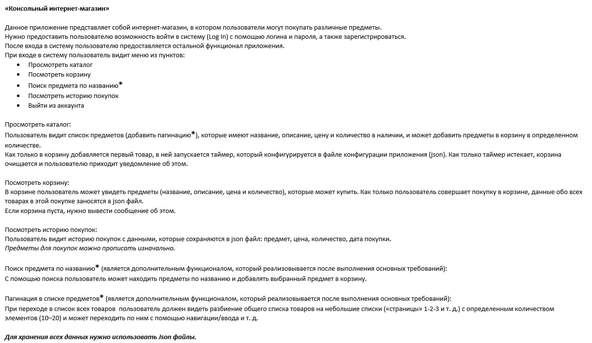

# "Console online store"

Console project "Console online store"

***
## Project status

***

## Project prototype

[Base prototype](https://app.mockplus.com/run/rp/RwPj7C_19pnd/8B2iCUnUzdl/OszRMl1Pu?ps=0&ha=0&la=0&fc=0&out=1)

***

## Roadmap

- [X] Core project ready:
  - [X] Catalog
  - [X] Working with database
  - [X] Account
  - [X] Basket
- [X] View project ready
- [ ] Controller ready:
  - [X] View controller
  - [ ] Core controller
  - [ ] General controller
- [ ] Extra functionality:
  - [ ] Search product by name
  - [ ] Pagination
- [ ] Test coverage
- [ ] Documentation

[:arrow_up_small:](#tic-tac-toe)

***

## Task description ##

[:arrow_up_small:](#tic-tac-toe)
***
